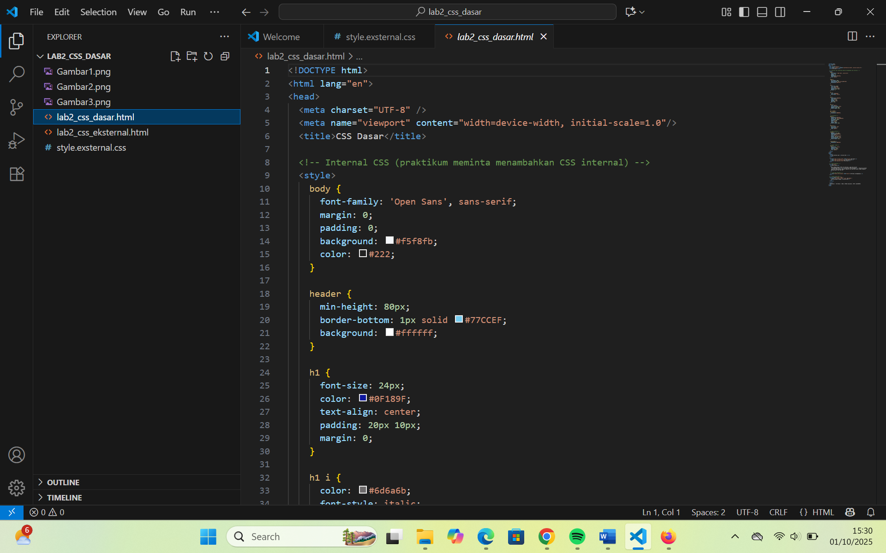

# Identitas Mahasiswa

**Nama :** Afdhal Agislam  
**NIM :** 312410445  
**Kelas :** TI.24.A5  

---
# Praktikum 2 - CSS Dasar

##  Screenshot

### Tampilan Awal

### Tampilan Akhir

### Tampilan Code

##  Deskripsi
Praktikum ini membahas dasar-dasar penggunaan **CSS (Cascading Style Sheets)** pada dokumen HTML.  
Tujuannya adalah memahami tiga cara penggunaan CSS (**inline, internal, eksternal**) serta mengenal selector (**tag, id, class**).  

## Penjelasan kode: `lab2_css_dasar.html`

### Gambaran Umum
File `lab2_css_dasar.html` adalah contoh halaman HTML yang digunakan untuk praktik CSS dasar.  
Pada file ini dipraktikkan 3 cara penulisan CSS:  
- **Internal CSS** → di dalam tag `<style>` pada `<head>`.  
- **Inline CSS** → langsung pada atribut `style` di elemen.  
- **Selector** → menggunakan elemen (`h1`), id (`#intro`), dan class (`.button`).  

Halaman terdiri dari `header`, `nav`, `konten intro`, contoh inline CSS, dan `footer`.

---

### Struktur File
- `<!DOCTYPE html>` → mendefinisikan dokumen sebagai HTML5.  
- `<head>` → berisi metadata, judul, dan internal CSS.  
- `<body>` → berisi konten tampilan (header, navigasi, konten intro, section, footer).  

---

### CSS Internal
Beberapa aturan penting:
- **`body`** → font, margin, padding, background, warna teks dasar.  
- **`header`** → tinggi minimum, border bawah, warna background.  
- **`h1` & `h1 i`** → ukuran, warna, align, style italic.  
- **`nav` & `nav a`** → bar navigasi dengan background hijau, padding, efek hover, dan link aktif.  
- **`#intro`** → ID selector untuk area utama, background biru, border, padding, border-radius.  
- **`.button` & `.btn-primary`** → class selector untuk tombol. `.btn-primary` memberi warna merah khusus.  
- **`footer`** → teks rata tengah, ukuran font kecil, warna abu-abu.  

---

### Konten Body
- **Header**: judul halaman.  
- **Navigasi (`nav`)**: link antar halaman (`CSS Dasar`, `CSS Eksternal`, `HTML Dasar`). Link aktif diberi class `active`.  
- **Intro (`#intro`)**: berisi `h1`, paragraf, dan tombol (`a` dengan class `button btn-primary`).  
- **Inline CSS**: paragraf dengan atribut `style="text-align: center; color: #ccd8e4;"`.  
- **Footer**: informasi praktikum, nama, NIM.  

---

### Konsep Penting
- **Selector elemen vs ID vs Class**:  
  - `h1` = semua heading `<h1>`.  
  - `#intro` = elemen dengan id `intro`.  
  - `.button` = semua elemen yang memakai class `button`.  
- **Cascade & Specificity (Prioritas CSS)**:  
  Urutannya → Inline > ID > Class > Elemen (kecuali ada `!important`).  
- **Internal vs External vs Inline**:  
  - Internal → CSS ditaruh di `<style>`.  
  - External → CSS dipisah di file `.css`.  
  - Inline → CSS langsung pada elemen HTML.  

---

##  Langkah Praktikum
1. **Membuat file `lab2_css_dasar.html`**  
   - Menambahkan CSS **internal** dalam tag `<style>`.  
   - Menambahkan contoh CSS **inline** langsung pada elemen `
`.  
   - Melatih penggunaan selector: elemen (`h1`), id (`#intro`), dan class (`.button`).  

2. **Membuat file `style_eksternal.css`**  
   - Memisahkan aturan styling dari file HTML.  
   - Berisi deklarasi CSS untuk body, header, nav, id selector, class selector, dan footer.  

3. **Membuat file `lab2_css_eksternal.html`**  
   - Menghubungkan HTML dengan CSS eksternal menggunakan tag `<link>`.  
   - Menampilkan hasil styling yang sama seperti internal CSS tetapi lebih rapi dan terpisah.  

4. **Menguji Cascade & Prioritas CSS**  
   - Inline CSS memiliki prioritas tertinggi dibanding internal dan eksternal.  
   - Selector `id` lebih kuat dibanding selector `class`.  
   - Jika semua aturan ada, maka urutan prioritas: **inline > id > class > elemen** (kecuali ada `!important`).  

5. **Validasi CSS**  
   - CSS divalidasi menggunakan [W3C CSS Validator](https://jigsaw.w3.org/css-validator/).

##  Jawaban Pertanyaan
**1. Perbedaan selector `h1` dan `#intro h1`**  
- `h1 { ... }` → berlaku untuk semua elemen `<h1>`.  
- `#intro h1 { ... }` → hanya berlaku untuk `<h1>` yang ada di dalam elemen dengan id `intro`.  

**2. Urutan prioritas jika ada inline, internal, dan eksternal CSS pada elemen yang sama**  
- Inline CSS memiliki prioritas paling tinggi.  
- Internal CSS lebih tinggi daripada eksternal CSS.  
- External CSS digunakan jika tidak ada aturan inline maupun internal.  

**3. Jika sebuah elemen punya `id` dan `class`, mana yang dipakai?**  
- ID (`#id`) lebih spesifik dan lebih kuat dibanding class (`.class`).  
- Jadi, aturan CSS dengan id akan dipakai jika ada konflik dengan aturan class.  

##  Kesimpulan
- CSS dapat ditulis dalam 3 cara: **inline, internal, dan eksternal**.  
- Penggunaan CSS eksternal lebih direkomendasikan karena memisahkan struktur HTML dan aturan tampilan.  
- Pemahaman cascade & specificity sangat penting agar styling konsisten.  

