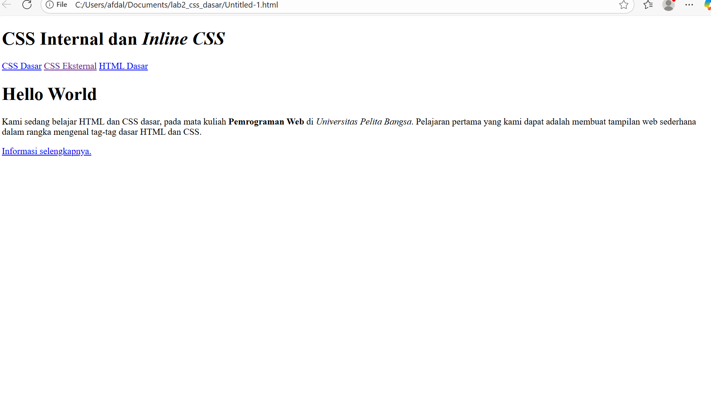
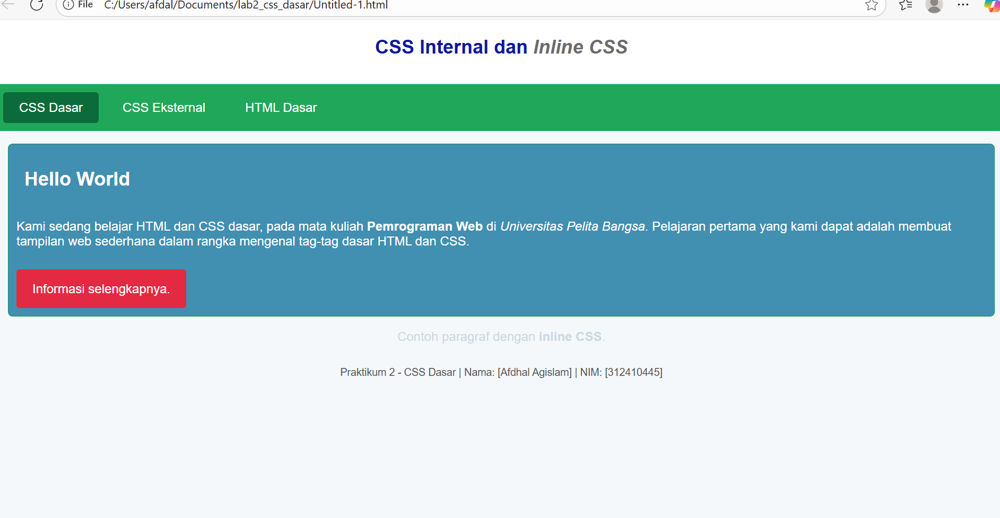

# Identitas Mahasiswa

**Nama :** Afdhal Agislam  
**NIM :** 312410445  
**Kelas :** TI.24.A5  

---
# Praktikum 2 - CSS Dasar

##  Screenshot

### Tampilan Awal

### Tampilan Akhir

##  Deskripsi
Praktikum ini membahas dasar-dasar penggunaan **CSS (Cascading Style Sheets)** pada dokumen HTML.  
Tujuannya adalah memahami tiga cara penggunaan CSS (**inline, internal, eksternal**) serta mengenal selector (**tag, id, class**).  

##  Struktur Folder

## Penjelasan Code
<!DOCTYPE html>
<html lang="en">
<head>
  <meta charset="UTF-8" />
  <meta name="viewport" content="width=device-width, initial-scale=1.0"/>
  <title>CSS Dasar</title>

  <!-- Internal CSS (praktikum meminta menambahkan CSS internal) -->
  
</head>
<body>
  <header>
    <h1>CSS Internal dan <i>Inline CSS</i></h1>
  </header>

  <nav>
    <a href="lab2_css_dasar.html" class="active">CSS Dasar</a>
    <a href="lab2_css_eksternal.html">CSS Eksternal</a>
    <a href="lab1_tag_dasar.html">HTML Dasar</a>
  </nav>

  <!-- CSS ID Selector -->
  

    <h1>Hello World</h1>
    

      Kami sedang belajar HTML dan CSS dasar, pada mata kuliah
      <b>Pemrograman Web</b> di <i>Universitas Pelita Bangsa</i>. Pelajaran pertama
      yang kami dapat adalah membuat tampilan web sederhana dalam rangka mengenal
      tag-tag dasar HTML dan CSS.
    

    <!-- CSS Class Selector -->
    <a class="button btn-primary" href="#intro">Informasi selengkapnya.</a>
  

  <!-- contoh inline CSS -->
  <section style="margin: 16px;">
    

      Contoh paragraf dengan <b>inline CSS</b>.
    

  </section>

  <footer>
   Praktikum 2 - CSS Dasar | Nama: [Afdhal Agislam] | NIM: [312410445]
</body>
</html>

##  Langkah Praktikum
1. **Membuat file `lab2_css_dasar.html`**  
   - Menambahkan CSS **internal** dalam tag `<style>`.  
   - Menambahkan contoh CSS **inline** langsung pada elemen `
`.  
   - Melatih penggunaan selector: elemen (`h1`), id (`#intro`), dan class (`.button`).  

2. **Membuat file `style_eksternal.css`**  
   - Memisahkan aturan styling dari file HTML.  
   - Berisi deklarasi CSS untuk body, header, nav, id selector, class selector, dan footer.  

3. **Membuat file `lab2_css_eksternal.html`**  
   - Menghubungkan HTML dengan CSS eksternal menggunakan tag `<link>`.  
   - Menampilkan hasil styling yang sama seperti internal CSS tetapi lebih rapi dan terpisah.  

4. **Menguji Cascade & Prioritas CSS**  
   - Inline CSS memiliki prioritas tertinggi dibanding internal dan eksternal.  
   - Selector `id` lebih kuat dibanding selector `class`.  
   - Jika semua aturan ada, maka urutan prioritas: **inline > id > class > elemen** (kecuali ada `!important`).  

5. **Validasi CSS**  
   - CSS divalidasi menggunakan [W3C CSS Validator](https://jigsaw.w3.org/css-validator/).

##  Jawaban Pertanyaan
**1. Perbedaan selector `h1` dan `#intro h1`**  
- `h1 { ... }` → berlaku untuk semua elemen `<h1>`.  
- `#intro h1 { ... }` → hanya berlaku untuk `<h1>` yang ada di dalam elemen dengan id `intro`.  

**2. Urutan prioritas jika ada inline, internal, dan eksternal CSS pada elemen yang sama**  
- Inline CSS memiliki prioritas paling tinggi.  
- Internal CSS lebih tinggi daripada eksternal CSS.  
- External CSS digunakan jika tidak ada aturan inline maupun internal.  

**3. Jika sebuah elemen punya `id` dan `class`, mana yang dipakai?**  
- ID (`#id`) lebih spesifik dan lebih kuat dibanding class (`.class`).  
- Jadi, aturan CSS dengan id akan dipakai jika ada konflik dengan aturan class.  

##  Kesimpulan
- CSS dapat ditulis dalam 3 cara: **inline, internal, dan eksternal**.  
- Penggunaan CSS eksternal lebih direkomendasikan karena memisahkan struktur HTML dan aturan tampilan.  
- Pemahaman cascade & specificity sangat penting agar styling konsisten.  

